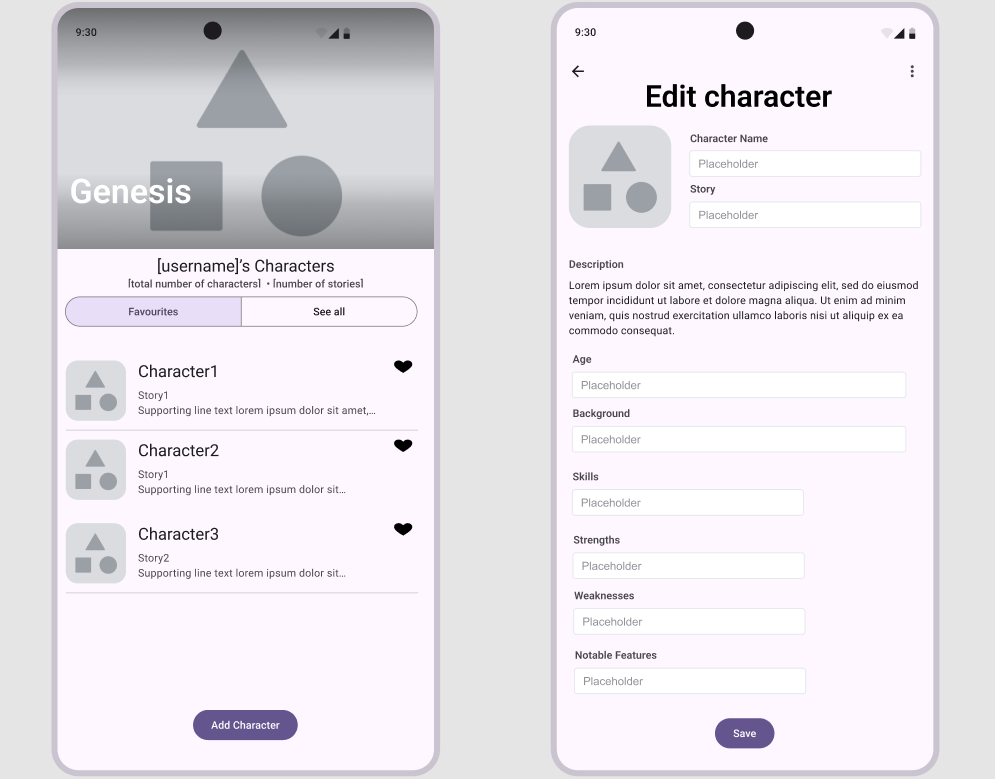

# Genesis

Welcome to **Genesis**, your ultimate tool for managing and organizing original characters for your creative projects. Whether you’re a writer building immersive worlds, a game master crafting intricate campaigns, or an artist breathing life into new personas, Genesis helps you track every detail effortlessly. Say goodbye to scattered notes and lost ideas—Genesis is designed to centralize and streamline your creative process, so you can focus on what matters: creating unforgettable characters. 

With its intuitive interface and features, Genesis provides both flexibility and control, allowing you to shape your characters with precision. Plus, its seamless online and offline functionality means your work is always accessible, whether you’re at your desk or on the go. Unlock the full potential of your creative universe with Genesis!

## Entity - Character

This is the core feature where users build and customize their characters for various projects. The available fields for each character include:
- **CharacterId**: A unique identifier for each character.
- **Name**: The character’s name. (e.g. Bartholomew the IIIrd)
- **Story**: The story that contains the character
- **Description**: The description, or maybe an excerpt of writing, that defines the character.
- **Age**: The character’s age (ranging anywhere from 0 to unknown, to increase the mystery)
- **Background**: A summary of the character’s history and origins, their motivations, and so on.
- **Skills**: Special abilities or talents the character possesses.
- **Strengths**: Key attributes that give the character an edge.
- **Weaknesses**: Areas where the character might struggle.
- **Notable Features**: Distinct traits or appearances that set the character apart.

## Operations

Users can manage their characters with the following options:
- ### Create a Character
Start crafting a new character by filling out key details like name, age, background, and skills. Once saved, the character is added to your roster for future access.

- ### View Details
Review the full profile of any character you’ve created. This feature presents all of the character’s attributes in a clear, organized format, allowing you to quickly reference important details during your projects.

- ### Edit a Character
Modify or update any character’s information as they evolve within your story or campaign. Easily adjust fields like backstory, strengths, or notable features to reflect changes.

- ### Delete a Character
Permanently remove a character from your roster. Before deletion, a confirmation ensures that no data is lost unintentionally, helping you maintain an organized and relevant character list.

## Online and Offline Behavior

- **Online**: All character management operations are available and changes are immediately saved to the server.
- **Offline**: Users can continue interacting with characters, with changes synced once online access is restored. Since this app is meant to increase productivity in a creative field, all operations are going to still be available, with the synchronization with the server is mostly used as a back-up service and as a way to access the data on desktop browsers.

## General Layout and Design

